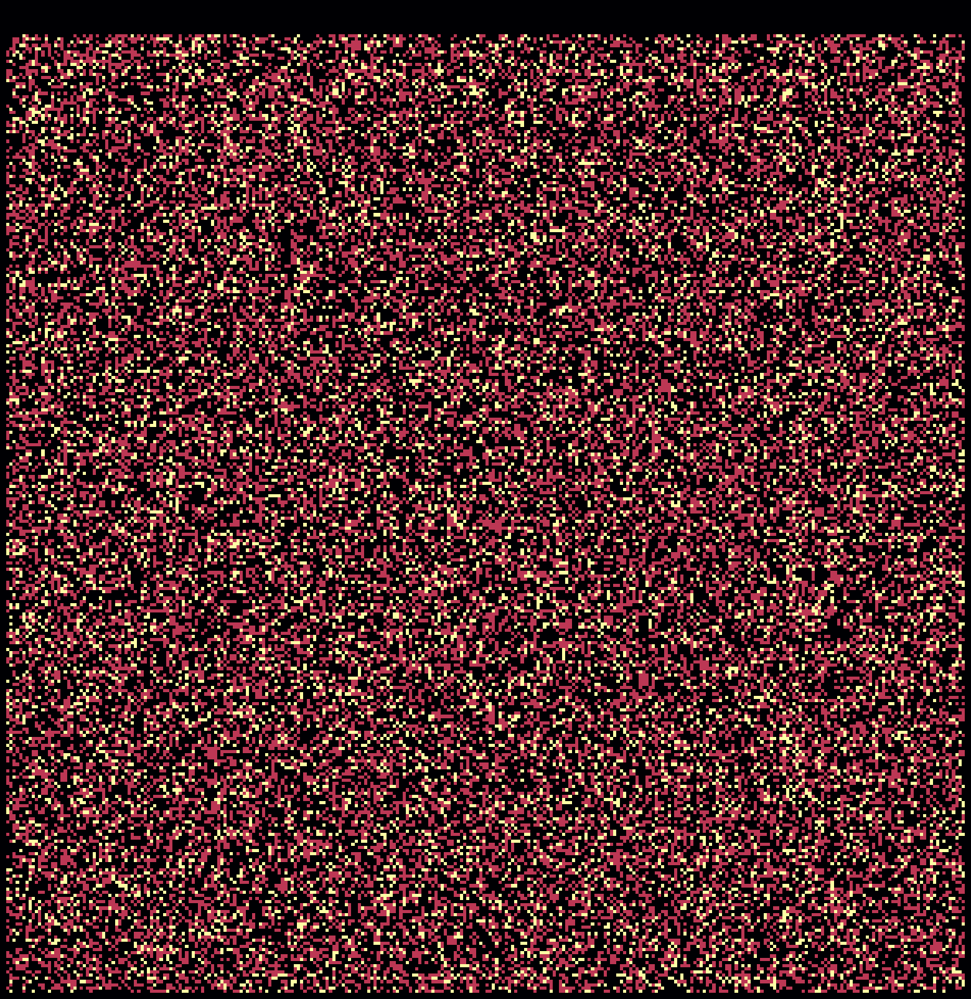

# Flow Matching Project: Modeling Wind

This project is based off the recently-published [Flow Matching Guide and Code](https://ai.meta.com/research/publications/flow-matching-guide-and-code/) from Meta. 

The flow matching problem is essentially a way to train a model to generate data from a known distribution. E.g., we start off with a normal distribution and then learn some transformation that maps it to a new target distribution. 

What we're actually learning is not the transformation itself, but a velocity field that describes the transformation. In other words, if $\psi(t,x)$ is the position of a particle at time $t$ and $x$ is the initial position, then the velocity field $u(t,x) = \frac{d\psi(t,x)}{dt}$ describes the velocity of the particle at time $t$ and position $x$. The general flow matching differential equation is:

$$
\frac{\text{d}}{\text{d}t} \psi(t, x) = u(t,\psi(t,x))
$$

And the goal is to learn $u(t,x)$, after which we can construct $\psi(t,x)$ using some ODE solver.

Remarkably, to do this, all we need is a dataset of initial and final positions of particles. That is to say, if we know where a particle is at time $t=0$ and $t=1$ (but not anywhere in between), we can learn the velocity field $u(t,x)$ that describes the transformation (for the details, I recommend reading the [guide](https://ai.meta.com/research/publications/flow-matching-guide-and-code/) -- I found it super accessible).

This project is split into two main components:

1. Data Generation Module 
2. Flow Matching Module

## Data Generation Module

The data generation module is responsible for creating the training data that we use to train our flow matching model. As mentioned above, the dataset only needs to contain the initial and final positions of particles. 

I used a single velocity field from the NOAA Global Forecast System (GFS) model to generate the training data (see [here](https://www.ncei.noaa.gov/products/weather-climate-models/global-forecast)). 

I then used RK4 approximation to generate trajectories from random initial positions (sampled at random on a sphere). 

Initial points are given by:
$$
\begin{align*}
\text{lat} &= \text{arcsin}(2U-1) \times \frac{180}{\pi} \\
\text{lon} &= U \times 360,
\end{align*}
$$
where $U$ is a random number drawn from a uniform distribution over (0,1).

See [here](https://en.wikipedia.org/wiki/Runge%E2%80%93Kutta_methods) for the RK4 equations. One small note: since the data we're dealing with is the northward ($v$) and eastward ($u$) velocity, to calculate $\Delta\theta$ and $\Delta\lambda$ (the change in latitude and longitude) we need to convert the velocity to a change in position:

$$
\begin{align*}
\Delta\theta &= \frac{v}{R} \\
\Delta\lambda &= \frac{u}{R \cos(\theta)}
\end{align*}
$$
where $R$ is the radius of the Earth (I just used 1 here).

The result is a pair of coordinates $(x_0, x_1)$ where $x_0=(\text{lat}_0, \text{lon}_0)$ is the initial position and $x_1=(\text{lat}_1, \text{lon}_1)$ is the final position. 

## Flow Matching Module

With the data generation module, we can now train the flow matching model. The code for this is in `src/core/model_dev.ipynb`.

First, we define a model $u^{\theta}(t,x)$ that takes as input a time $t$ and position $x$ and outputs a velocity field (in my case I used a simple MLP). I then trained it using the flow matching framework:
  - For each $x_0$ and $x_1$, constuct a path between the two points and select a random time $t$ along the path. 
  - Predict the velocity field $u^{\theta}(t,x)$ at time $t$ and position $x$. 
  - Compute MSE between the predicted velocity field and the true velocity field (computed using the constructed path). 
  - Backpropagate the loss to update the model parameters. 

After training, I visualized the learned flow (see the GIF at the top of this README).

## Limitations of this project

1. I don't handle the boundary conditions particularly well (e.g., if a particle reaches a longitude of 360 degrees, it should wrap around to 0 degrees. Instead I just fix the particle at the boundary). If I simply wrapped this data, the model would learn some crazy behavior at the boundary though. For this, a more sophisticated approach would be needed 
2. I trained this model on my laptop for ~30 mins. I imagine more training time would yield better results. 
3. I also only used a simple MLP for this (again, b/c of using my own laptop). Would be interested to see how a more complex architecture performs. 
4. I used a single velocity field to generate the training data. I imagine using a more complex (e.g., time-dependent) could produce more interesting results. 